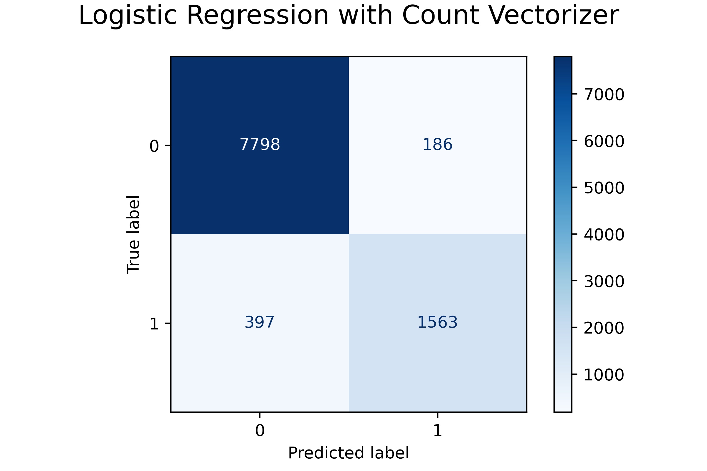

# Project 3

### Contents:
- [Problem Statement](#Problem-Statement)
- [Data Dictionary](#Data-Dictionary)
- [Brief Summary of Analysis](#Brief-Summary-of-Analysis)
- [Conclusions and Recommendations](#Conclusions-and-Recommendations)

## Problem Statement

This is a binary classification problem. We are given a dataset containing recipes and their ingredients. Measurements are not included. We want to design a model that can classify a recipe as being of Italian cuisine (class 1) or other (class 0). Data is originally acquired in JSON format. My taks is to create two models and evaluate them, then pick the model with the best accuracy.

## Data Dictionary

|Feature|Type|Description|
|---|---|---|
|id|int|Numerical ID of the recipe|
|cuisine|object|The cuisine for the recipe|
|ingredients|object|List of strings representing the recipe's ingredients|
|no_ingredients|int|Featured: the number of ingredients in a recipe|
|ingredients_str|obj|Featured: ingredients represented as a string|

## Brief Summary of Analysis

I used Kaggle's dataset of recipes. Each observation includes the recipe's numerical ID, cuisine, and list of ingredients. This dataset did not need cleaning. I engineered some additional features: number of ingredients for each recipe, and the list of ingredients as a single string. I performed EDA and answered questions about the data.

How many different types of cuisines does the dataset contain? How many recipes of each type are there?

What are some of the recipes with the most number of ingredients?

Which cuisines have the most ingredients, on average?

Distribution of the no_ingredients variable.

To classify recipes into class 1 (Italian cuisine) or class 0 (Other cuisine), I built two models. Multinomial Naive Bayes with TFIDF vectorizer, and Logistic Regression with Count Vectorizer.

 

|             |   NB with TFIDF |   LR with CV |
|:------------|----------------:|-------------:|
| best score  |          0.9243 |       0.9391 |
| train score |          0.9281 |       0.9506 |
| test score  |          0.927  |       0.9414 |
| sensitivity |          0.752  |       0.7974 |
| specificity |          0.9699 |       0.9767 |
| precision   |          0.86   |       0.8937 |
| accuracy    |          0.927  |       0.9414 |

## Conclusions and Recommendations

**Conclusions:**  

(1) The best model for our problem is the Logistic Regression model with CountVectorizer, with an accuracy of 94%.

**Data Sources:**  

(1) [Kaggle](https://www.kaggle.com/c/whats-cooking/data?select=train.json.zip)